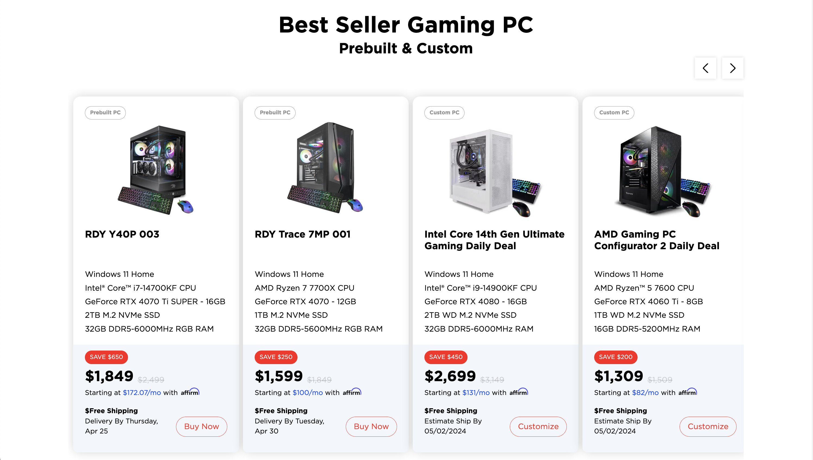
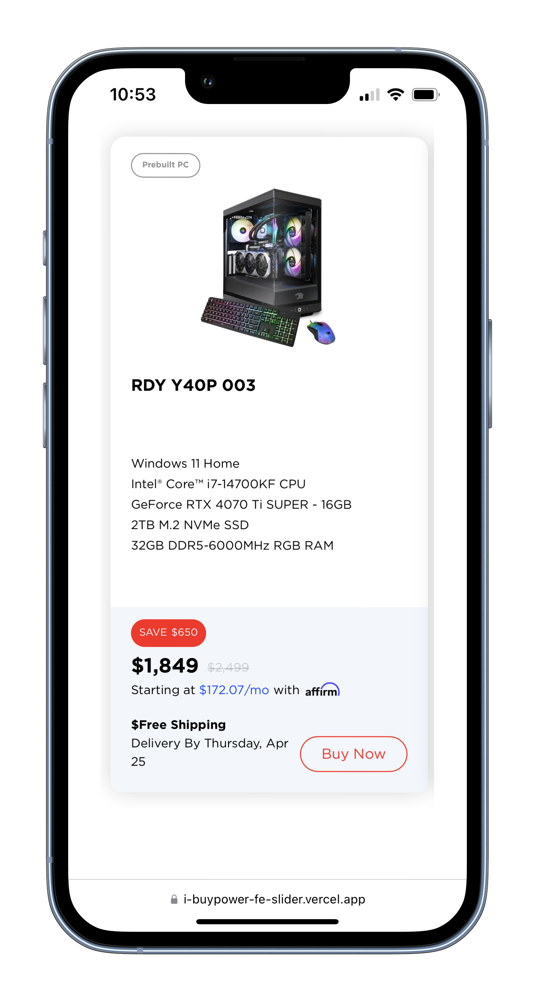

# Front-End-Developer-Exam
專案連結： [https://i-buypower-fe-slider.vercel.app/](https://i-buypower-fe-slider.vercel.app/)

專案開發紀錄：[開發規劃與紀錄](https://james-lee.notion.site/iBUYPOWER-FE-33aa4ddad71b438aa08a2d6816171e51)



這是一個根據設計稿規劃，透過 [`create-next-app`](https://github.com/vercel/next.js/tree/canary/packages/create-next-app) 建置的 [Next.js](https://nextjs.org/) 專案。採用 React 及 Typescript 撰寫，UI 使用 Tailwind CSS 及 Swiper 套件製作的 Carousel Slider (輪播幻燈片元件)。

 
(行動裝置畫面)

## 功能
- 幻燈片功能。
- 在桌機版具有左右選擇按鈕，最多顯示4筆資料，支援滑鼠拖曳或觸控左右滑動 (swipe)。


- 在手機版隱藏左右選擇按鈕，一次最多顯示1筆，改採觸控左右滑動 (swipe)。


## 環境建置
1. 請先確認有安裝 node.js 與 npm。
2. 開啟終端機(Terminal)進入到存放專案的本機位置，執行以下將專案 clone ： 

    ```
    git clone https://github.com/James-Lee-01/iBuypower-FE-slider.git
    ```
3. 進入存放此專案的資料夾，開啟之後，透過終端機輸入：

   ```bash
   npm install
   ```

4. 安裝完畢後，執行程式：
    ```
    npm run dev
    ```

5. 打開瀏覽器進入到以下網址：[http://localhost:3000](http://localhost:3000) 執行，終端機出現以下訊息則代表成功執行：

   ```bash
    ✓ Starting...
    ✓ Ready in __ms
   ```
    

6. 若欲暫停使用請執行以下：

   ```bash
   ctrl + c
   ```

## 開發工具
- Next: v14.2.2
- Tailwindcss: v3.4.1
- React: v18
- Typescript: v5
- Swiper: v11.1.1
-  svgr/webpack: v8.1.0